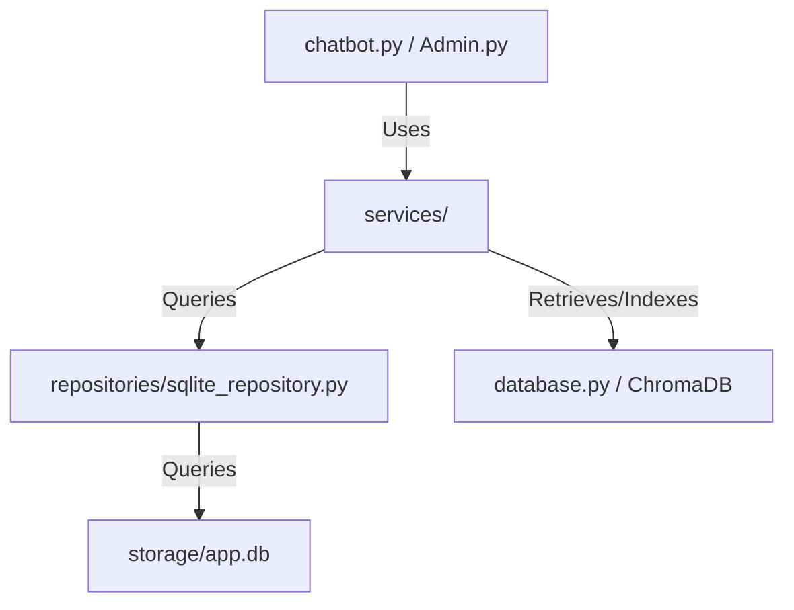

# System Architecture — InquiryBot Enterprise

## 1. Architectural Style
InquiryBot Enterprise is designed as a **Layered Modular Monolith**. Each operational layer is decoupled, ensuring that presentation, business logic, data access, and vector retrieval do not leak into one another.

## 2. System Layers
*   **Presentation Layer (`chatbot.py`, `pages/Admin.py`):** Handles all visual layouts, UI components, states, forms, and triggers. No SQL or direct OpenAI/Chroma interactions occur here.
*   **Service Layer (`services/`):** Implements organization-specific business rules. Orchestrates interactions between repositories, vector engines, and external APIs.
    *   `chat_service.py` - Manages chat prompts, vector searching, LLM processing, and citations.
    *   `lead_service.py` - Manages lead verification, creation, and deduplication logic.
    *   `document_service.py` - Orchestrates file uploads, SHA-256 calculation, and ingestion.
    *   `training_service.py` - Synchronizes FAQ additions and vector embeddings.
    *   `admin_service.py` - Performs metrics aggregation and active user tracking.
*   **Repository Layer (`repositories/sqlite_repository.py`):** Acts as the sole gatekeeper to relational data. Formulates parameterized SQL queries to SQLite, returning clean schemas/dataclasses.
*   **Persistence & Data Layer:** SQLite (`storage/app.db`) for structural data, and ChromaDB (`chroma_db/`) for embedded chunks.

## 3. Operations Workflows

### A. RAG Chat Workflow
1.  **User Inquiry:** User submits query via `chatbot.py` chat input.
2.  **Verification:** UI requests `lead_service` to retrieve or resolve the lead session.
3.  **Context Retrieval:** `chat_service` uses `database.py` to retrieve the top $K$ relevant document and FAQ chunks from ChromaDB.
4.  **Guardrail Filtering:** Retrieved chunks are scored using a normalized relevance metric. Chunks below `0.35` similarity are rejected.
5.  **Prompt Assembly:** Prompt builder merges approved context chunks, anti-hallucination constraints, and the user query into a clean chat template.
6.  **LLM Generation:** Complete payload is submitted to OpenAI's generative completion endpoint.
7.  **Citation Serialization:** Generative output is scanned, and citation indices are mapped back to their document or training-entry sources.
8.  **Message Persistence:** The query, response, and citations are stored in SQLite via `sqlite_repository.py`.
9.  **Rendering:** Chatbot UI renders the answer with distinct, interactive citation bubbles.

### B. Admin Panel Workflow
1.  **Login Gating:** Admin logs in using the credential screen, validated by `config.py` overrides.
2.  **Active Session Compilation:** `admin_service` runs aggregate SQLite queries to identify sessions with user activity within the last 10 minutes.
3.  **CRM Management:** Admin views, annotates, or updates status changes for captured leads.
4.  **Training Synchronization:** FAQ submissions are stored in SQLite, converted to documents, embedded, and written to ChromaDB under deterministic IDs.

## 4. Architectural Principles
*   **Single Responsibility:** Each service class or file manages exactly one domain boundary (e.g. `lead_service` handles only lead states, never vector database chunking).
*   **Dependency Isolation:** All data access is funneled through `sqlite_repository.py`. The UI and services never issue direct `CURSOR.execute` calls.
*   **Deterministic Ingestion:** Files and training chunks use standardized ID generation processes (SHA-256 hashes) to ensure that vector database records are strictly idempotent.
